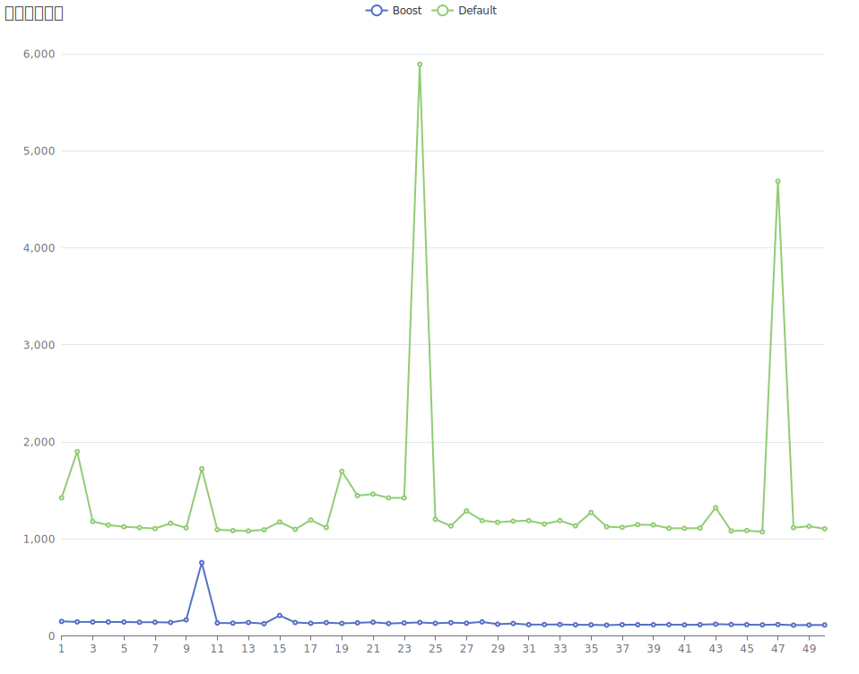
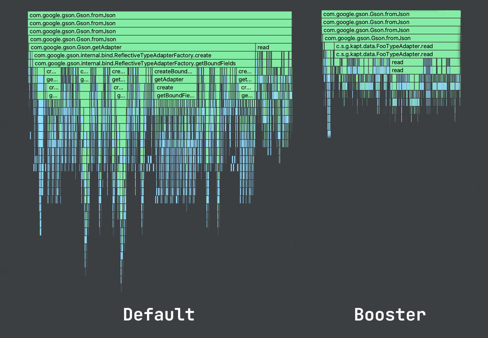

# GsonBooster
[](https://maven-badges.herokuapp.com/maven-central/com.spirytusz/booster-annotation)

GsonBooster是一个注解处理器，能够在编译期自动生成**兼容Kotlin特性的**、**高性能TypeAdapter**，以提升Gson的序列化与反序列化时间性能。

## Download
<details open>
  <summary>Gradle</summary>

```groovy
plugins {
    id 'kotlin-kapt'
}

dependencies {
    implementation("com.spirytusz:booster-annotation:$last_versoin")
    kapt("com.spirytusz:booster-processor:$last_version")
}

kapt {
    arguments {
        // 指定生成TypeAdapterFactory的全限定名，不指定则不生成
        arg("factory", "com.spirytusz.booster.BoosterTypeAdapterFactory")
    }
}
```
</details>

<details close>
  <summary>Kotlin-DSL</summary>

```kotlin
plugins {
    kotlin("kapt")
}

dependencies {
    implementation("com.spirytusz:booster-annotation:$last_versoin")
    kapt("com.spirytusz:booster-processor:$last_version")
}

kapt {
    arguments {
        // 指定生成TypeAdapterFactory的全限定名，不指定则不生成
        arg("factory", "com.spirytusz.booster.BoosterTypeAdapterFactory")
    }
}
```
</details>

## Usage

```kotlin
// 增加注解
@Boost
data class Foo(
    val string: String = ""
)

// 生成的TypeAdapterFactory注册到gson实例中
val gson = GsonBuilder()
        .registerTypeAdapterFactory(BoosterTypeAdapterFactory())
        .create()
```

## Why
### Benchmark

* OS: Android 10
* CPU: Snapdragon 855
* Core: 4

经过预热的场景下，可以看到耗时从毫秒级降低到了微秒级(横坐标为实验次数，纵坐标为耗时，单位微秒(us)):



可以从火焰图中看到反射部分（ReflectiveTypeAdapterFactory.create）被优化掉，耗时大幅缩短。



## KSP-Support
[KSP(Kotlin Symbol Processing)](https://github.com/google/ksp)是Google推出的更高性能、源码级的注解处理器，GsonBooster也对KSP作了支持。

<details open>
  <summary>Gradle</summary>

根目录build.gradle

```groovy
buildscripts { ... }

plugins {
    id('com.google.devtools.ksp') version "$kotlin_version-1.0.0"
}
```

app模块build.gradle

```groovy
plugins {
    id('com.google.devtools.ksp')
}

android {
    // KSP生成的代码不能被IDE自动识别到，需要手动添加到sourceSets中
    buildTypes {
        debug {
            sourceSets.main {
                java.srcDir("build/generated/ksp/debug/kotlin")
            }
        }
        release {
            sourceSets.main {
                java.srcDir("build/generated/ksp/release/kotlin")
            }
        }
    }
}

dependencies {
    implementation('com.spirytusz:booster-annotation:$last_versoin')
    ksp('com.spirytusz:booster-processor-ksp:$last_version')
}

ksp {
    // 指定生成TypeAdapterFactory的全限定名，不指定则不生成
    arg('factory', 'com.spirytusz.booster.ksp.BoosterTypeAdapterFactory')
}
```

</details>

<details close>
  <summary>Kotlin DSL</summary>

根目录下的build.gradle

```kotlin
plugins {
    kotlin("jvm")
    id("com.google.devtools.ksp") version "$kotlin_version-1.0.0"
}
```

app模块build.gradle

```kotlin
plugins {
    id("com.google.devtools.ksp")
}

android {
    // KSP生成的代码不能被IDE自动识别到，需要手动添加到sourceSets中
    buildTypes {
        getByName("debug") {
            sourceSets.getByName("main") {
                java.srcDir("build/generated/ksp/debug/kotlin")
            }
        }
        getByName("release") {
            sourceSets.getByName("main") {
                java.srcDir("build/generated/ksp/release/kotlin")
            }
        }
    }
}

dependencies {
    implementation("com.spirytusz:booster-annotation:$last_versoin")
    ksp("com.spirytusz:booster-processor-ksp:$last_version")
}

ksp {
    // 指定生成TypeAdapterFactory的全限定名，不指定则不生成
    arg("factory", "com.spirytusz.booster.ksp.BoosterTypeAdapterFactory")
}
```
</details>

## License
```
MIT License

Copyright (c) 2021 ZSpirytus

Permission is hereby granted, free of charge, to any person obtaining a copy
of this software and associated documentation files (the "Software"), to deal
in the Software without restriction, including without limitation the rights
to use, copy, modify, merge, publish, distribute, sublicense, and/or sell
copies of the Software, and to permit persons to whom the Software is
furnished to do so, subject to the following conditions:

The above copyright notice and this permission notice shall be included in all
copies or substantial portions of the Software.

THE SOFTWARE IS PROVIDED "AS IS", WITHOUT WARRANTY OF ANY KIND, EXPRESS OR
IMPLIED, INCLUDING BUT NOT LIMITED TO THE WARRANTIES OF MERCHANTABILITY,
FITNESS FOR A PARTICULAR PURPOSE AND NONINFRINGEMENT. IN NO EVENT SHALL THE
AUTHORS OR COPYRIGHT HOLDERS BE LIABLE FOR ANY CLAIM, DAMAGES OR OTHER
LIABILITY, WHETHER IN AN ACTION OF CONTRACT, TORT OR OTHERWISE, ARISING FROM,
OUT OF OR IN CONNECTION WITH THE SOFTWARE OR THE USE OR OTHER DEALINGS IN THE
SOFTWARE.
```
